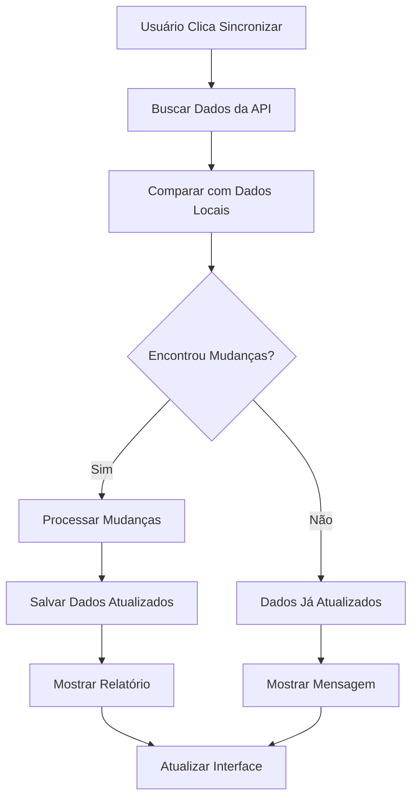

# Sincronização Automática do Hideout com Tarkov.dev

## 🚀 Visão Geral

O sistema de sincronização automática permite manter os dados do hideout sempre atualizados com as últimas mudanças do Escape from Tarkov, usando a API oficial do [Tarkov.dev](https://api.tarkov.dev/graphql).

## ✨ Funcionalidades

- **Sincronização Automática**: Busca dados atualizados da API do Tarkov.dev
- **Comparação Inteligente**: Identifica mudanças entre dados locais e da API
- **Relatório Detalhado**: Mostra exatamente o que foi alterado
- **Atualização em Tempo Real**: Mantém requisitos sempre corretos
- **Sem Perda de Dados**: Preserva seu progresso local

## 🔧 Como Funciona

### 1. API GraphQL do Tarkov.dev

O sistema usa a API GraphQL oficial do Tarkov.dev para buscar:

- **Estações do Hideout**: Todas as estações disponíveis
- **Requisitos por Nível**: Itens, traders, skills e módulos necessários
- **Informações dos Itens**: Nomes, descrições e imagens
- **Dados Atualizados**: Sempre com as últimas mudanças do jogo

### 2. Processo de Sincronização

```typescript
// 1. Buscar dados da API
const apiData = await getHideoutRequirements();

// 2. Comparar com dados locais
const changes = compareWithLocalData(localData);

// 3. Identificar mudanças
const {
  newStations, // Novas estações
  updatedStations, // Estações atualizadas
  newItems, // Novos itens
  changedQuantities, // Quantidades alteradas
} = changes;

// 4. Salvar dados atualizados
localStorage.setItem("kappa-hideout-data", JSON.stringify(updatedData));
```

### 3. Tipos de Mudanças Detectadas

- **🆕 Novas Estações**: Estações que não existiam localmente
- **🔄 Estações Atualizadas**: Estações com novos níveis ou requisitos
- **📦 Novos Itens**: Itens adicionados aos requisitos
- **🔢 Quantidades Alteradas**: Mudanças nas quantidades necessárias

## 📱 Interface do Usuário

### Componente HideoutSync

O componente `HideoutSync` é exibido na página do hideout e oferece:

- **Botão de Sincronização**: Inicia o processo de atualização
- **Status Visual**: Mostra o estado atual da sincronização
- **Estatísticas**: Exibe resumo das mudanças encontradas
- **Relatório Detalhado**: Botão para ver todas as alterações

### Estados da Sincronização

- **🔄 Sincronizando**: Processo em andamento
- **✅ Sucesso**: Dados atualizados com sucesso
- **❌ Erro**: Problema na sincronização
- **⏸️ Inativo**: Pronto para sincronizar

## 🛠️ Implementação Técnica

### Hooks Utilizados

#### `useTarkovApi()`

```typescript
const {
  items, // Lista de itens da API
  hideoutStations, // Estações do hideout
  loading, // Estado de carregamento
  error, // Erros da API
  refreshData, // Atualizar todos os dados
  searchItems, // Buscar itens específicos
  getHideoutRequirements, // Buscar requisitos do hideout
  getItemsMap, // Mapeamento ID → Nome
  compareWithLocalData, // Comparar dados locais vs API
  generateChangeReport, // Gerar relatório de mudanças
} = useTarkovApi();
```

### Utilitários de Conversão

#### `convertApiDataToLocalFormat()`

Converte dados da API para o formato usado pelo sistema local:

```typescript
const localStations = convertApiDataToLocalFormat(apiStations, apiItems);
```

#### `compareHideoutData()`

Compara dados locais com dados da API:

```typescript
const changes = compareHideoutData(localData, apiData);
```

#### `generateChangeReport()`

Gera relatório legível das mudanças:

```typescript
const report = generateChangeReport(changes);
console.log(report);
// 📊 Relatório de Sincronização
//
// 🆕 Novas Estações:
//   • Bitcoin Farm
//   • Solar Power
//
// 🔄 Estações Atualizadas:
//   • Generator
//
// 📦 Novos Itens:
//   • Electric Motor
//   • Construction Measuring Tape
//
// 🔢 Quantidades Alteradas:
//   • Generator Nível 2: Electric Motor (2 → 3)
```

## 🔄 Fluxo de Sincronização



## 📊 Exemplo de Uso

### 1. Primeira Sincronização

```typescript
// Ao clicar em "Sincronizar Agora"
const handleSync = async () => {
  try {
    // Buscar dados da API
    const apiData = await getHideoutRequirements();

    // Salvar dados iniciais
    localStorage.setItem("kappa-hideout-data", JSON.stringify(apiData));

    // Mostrar sucesso
    setSyncStatus("success");
  } catch (error) {
    setSyncStatus("error");
  }
};
```

### 2. Sincronizações Subsequentes

```typescript
// Comparar e identificar mudanças
const changes = compareWithLocalData(localData);

if (changes.newStations.length > 0) {
  console.log("Novas estações encontradas:", changes.newStations);
}

if (changes.changedQuantities.length > 0) {
  console.log("Quantidades alteradas:", changes.changedQuantities);
}
```

## 🚨 Tratamento de Erros

### Erros Comuns

- **Erro de Rede**: Problemas de conectividade
- **API Indisponível**: Servidor do Tarkov.dev fora do ar
- **Dados Inválidos**: Resposta da API em formato inesperado
- **Rate Limiting**: Muitas requisições em pouco tempo

### Estratégias de Fallback

1. **Retry Automático**: Tentar novamente após alguns segundos
2. **Dados Locais**: Usar dados salvos localmente se a API falhar
3. **Notificação ao Usuário**: Informar sobre problemas de sincronização
4. **Log de Erros**: Registrar erros para debugging

## 🔒 Segurança e Privacidade

- **Sem Dados Pessoais**: A API não recebe informações do usuário
- **Apenas Leitura**: O sistema apenas busca dados, não envia nada
- **Dados Locais**: Seu progresso fica salvo apenas no seu navegador
- **API Pública**: Tarkov.dev é uma API pública e oficial

## 📈 Benefícios

### Para o Usuário

- **Dados Sempre Atualizados**: Requisitos corretos do jogo
- **Sem Atualização Manual**: Não precisa verificar mudanças
- **Confiança nos Dados**: Informações oficiais do Tarkov
- **Economia de Tempo**: Foco no progresso, não na manutenção

### Para o Desenvolvimento

- **Manutenção Automática**: Dados se atualizam sozinhos
- **Qualidade dos Dados**: Sem erros de digitação manual
- **Escalabilidade**: Funciona com qualquer mudança do jogo
- **Confiabilidade**: Fonte oficial de dados

## 🚀 Próximos Passos

### Funcionalidades Futuras

- **Sincronização Automática**: Atualizar dados periodicamente
- **Notificações Push**: Alertar sobre mudanças importantes
- **Histórico de Mudanças**: Rastrear todas as alterações
- **Backup na Nuvem**: Sincronizar progresso entre dispositivos
- **API Key**: Suporte para usuários premium do Tarkov.dev

### Integrações

- **Discord Bot**: Notificações via Discord
- **Telegram Bot**: Alertas via Telegram
- **Email**: Relatórios semanais por email
- **Webhook**: Integração com outros sistemas

## 📚 Recursos Adicionais

- [Documentação da API Tarkov.dev](https://api.tarkov.dev/graphql)
- [Schema GraphQL](https://api.tarkov.dev/graphql)
- [Exemplos de Queries](https://api.tarkov.dev/examples)
- [Status da API](https://status.tarkov.dev)

## 🤝 Contribuição

Para contribuir com o sistema de sincronização:

1. **Fork do Projeto**: Faça um fork do repositório
2. **Criar Branch**: Crie uma branch para sua feature
3. **Implementar**: Desenvolva a funcionalidade
4. **Testar**: Verifique se tudo funciona
5. **Pull Request**: Envie sua contribuição

## 📞 Suporte

Se encontrar problemas com a sincronização:

1. **Verificar Console**: Abra o DevTools e veja os logs
2. **Status da API**: Confirme se Tarkov.dev está funcionando
3. **Relatar Bug**: Abra uma issue no GitHub
4. **Discord**: Entre no servidor da comunidade

---

**Nota**: Este sistema depende da disponibilidade da API do Tarkov.dev. Em caso de problemas, os dados locais continuarão funcionando normalmente.
